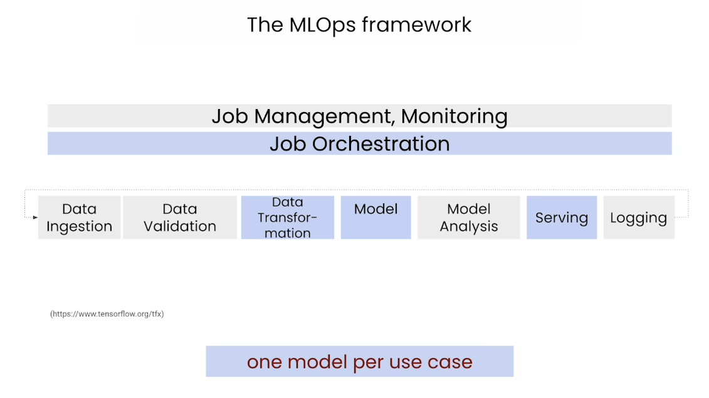
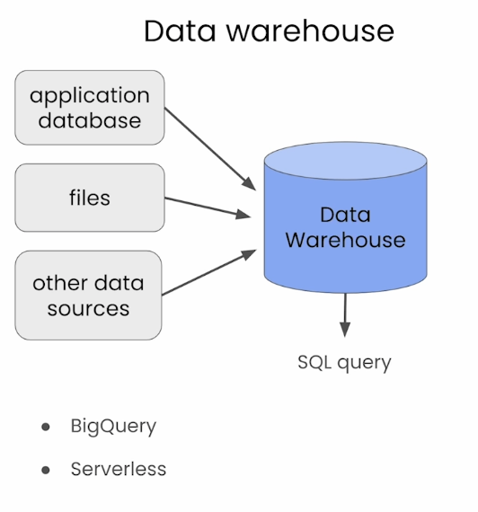
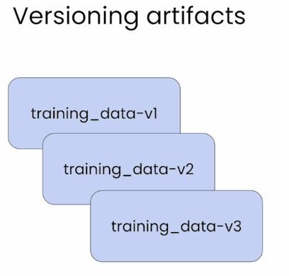
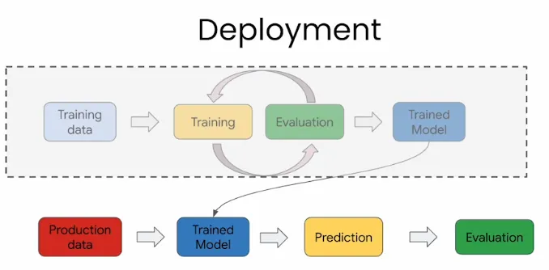

# LLMOps by Google Cloud

 
 

  <a href="https://basel-workspace.notion.site/LLMOps-by-Google-Cloud-17049007fa268014bf24f67ecf04b010?pvs=74" target="_blank" style="text-decoration: none;">
    <table style="border: 2px solid #4caf50; border-radius: 10px; padding: 10px; background-color: #e8f5e9; max-width: 700px; box-shadow: 0 4px 6px rgba(0, 0, 0, 0.1); font-family: Arial, sans-serif;">
      <tr>
        <td align="center" style="padding: 15px;">
          
        </td>
        <td style="padding: 15px; text-align: left;">
          <h2 style="margin: 0; color: #2e7d32;">Explore Full Summary in Notion</h2>
          
Click here to view the detailed version with enhanced visuals and interactive content!

        </td>
      </tr>
    </table>
  </a>

 
 

## Lecture 1: The Fundamentals

### MLOps:

Automate & Monitoring at all steps of ML system construction, including:

1. Integration
2. Testing
3. Releasing
4. Deployment
5. Infrastructure Management

### LLMOps vs LLM System Design:

#### LLMOps (MLOps for LLMs)

Focusing on the LLM development and managing the model in production

- Experiment Foundation Models
- Prompt Design & Management
- Supervised Tuning
- Monitoring
- Evaluate Generative Output

#### LLM System Design

Broader design of the entire end-to-end application

- Chain Multiple LLMs Together
- Grounding
- Track History

### High-Level Example of a LLM Driven Application

### LLMOps Pipeline

## Lecture 2: Data Preparation

This lecture is showing an implementation of how to prepare the data for doing Parameter Efficient Fine-Tuning (PEFT) for your LLM.

It talks about loading Huge amount of data that cannot be loaded into memory, data warehouses, file types, versioning, etc.

### Data Warehouse

The implementation of this lecture by using the Google Data Warehouse called BigQuery to load the Stack Over Flow Dataset.

The Data Warehouse could have application database, files, and other source. Also, it can be queried through SQL.

The BigQuery Data Warehouse is SQL Query and Serverless.

### Memory Issue

It is hard to load huge amount of data into Pandas Data Frame, therefore, SQL is the solution, where we get the data from the place where it lives, and do the methodology we want.

### File Format Train and Evaluation

#### JSONL

JSON Lines will make each question and answer on a row. It is human readable and an ideal choice for small to medium sized datasets.

#### TFRecord

Binary format and easier to read for computers, make it ideal for efficient training.

#### Parquet

Good Choice for large and complex datasets.

### Versioning Artifact

Always try to version your data to keep monitoring the evaluation efficiently without mixing up wrong information.

You can version the datasets by the current date of creating it

When you are evaluating your model, don’t change too many hyperparameters each time, this is because to learn and see how each parameter affects your model and evaluation

## Lecture 3: Automation and Orchestrations with Pipelines

### MLOps workflow for LLMs

#### Orchestration:

When you specify the order of workflow, which step before the other etc.

Orchestrate the Sequence of steps.

#### Automation

Automate the Workflow resulting from the Orchestration Step

Automate the Execution of the workflow.

#### DSL:

For Orchestration & Automation, you can use:

1. Airflow
2. Kubeflow

The rest of the lecture will be on the practical implementation of a Kubeflow pipeline.

## Lecture 4: Predictions, Prompts, and Safety

### Deployment:

#### Batch:

for batch training or Inferencing

#### REST API:

for building an API for the application to enable other components to talk and access the service

#### Framework for making APIs:

1. FastAPI
2. Flask

### Beyond Deployment

- Package, Deploy, and Version
- Model Monitoring: metrics & safety
- Inference Scalability:
    - Load Test
- Latency: permissible latency
    - Smaller Models
    - Faster Processors (GPUs, TPUs)

The rest of the lecture is about implementation using Vertex AI Framework from Google.
