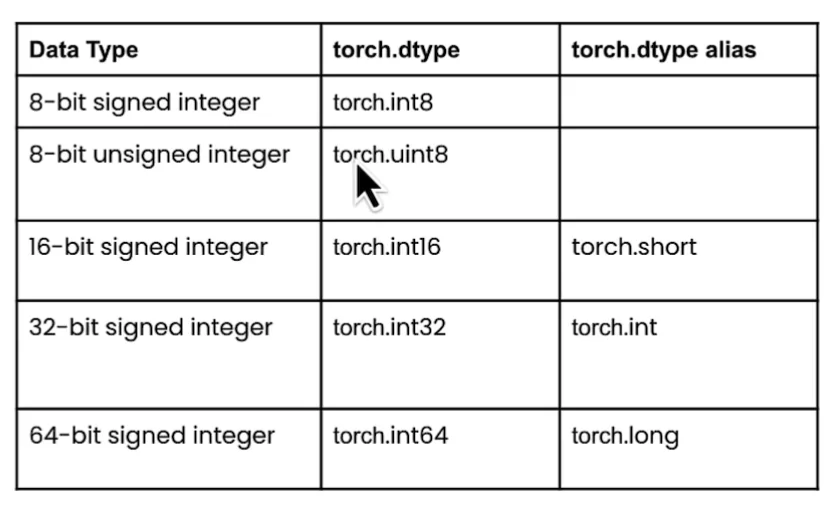
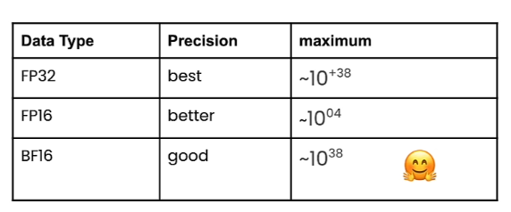

# Quantization Fundamentals with Hugging Face

 
 

  <a href="https://basel-workspace.notion.site/Quantization-Fundamentals-with-Hugging-Face-16c49007fa268086954ff0a56a4df41f" target="_blank" style="text-decoration: none;">
    <table style="border: 2px solid #4caf50; border-radius: 10px; padding: 10px; background-color: #e8f5e9; max-width: 700px; box-shadow: 0 4px 6px rgba(0, 0, 0, 0.1); font-family: Arial, sans-serif;">
      <tr>
        <td align="center" style="padding: 15px;">
          
        </td>
        <td style="padding: 15px; text-align: left;">
          <h2 style="margin: 0; color: #2e7d32;">Explore Full Summary in Notion</h2>
          
Click here to view the detailed version with enhanced visuals and interactive content!

        </td>
      </tr>
    </table>
  </a>

 
 

## Lecture 1: Handling Big Models

Quantization is shrinking models to small size, so that any one can run it on their own computer with no performance degradation.

### Model Compression Techniques (Not covered in the course):

#### 1. Pruning:

Remove connections/nodes/weights that are not important for the model.

#### 2.  Knowledge Distillation

Train Smaller Model (student) using the original model (teacher)

### Quantization

Idea: Store the parameters of the model in lower precision (for example, from `fp32` → `int8`)

 

# Lecture 2: Data Types and Sizes

### Integer Data Type:

#### Unsigned Integer (Always Positive):

- Range: for n-bits → $[ 0 , 2^n-1 ]$
- So, if:
    - INT8, then range [0, 255] →  $255 = 2^8-1$
    - INT4, then range [0, 127] → $127 = 2^4-1$

#### Signed Integer:

- Range: for n-bits → $[-2^{n-1}, 2^{n-1}-1]$
- So, if:
    - INT8, then range [-128, 127]
    - INT4, then range [-16, 15]

#### Integer in Pytorch

### Floating Point

#### 3 Components in floating point:

- Sign: Positive/Negative (always 1 bit)
- Exponent (Range): The representable range of number.
- Fraction (Precision): Impact the precision of the number (Number of numbers after the digit)

#### FP32

Almost the standard datatype for the weights/parameters of any AI Model. The 32 bits are divided as:

- Sign: 1 bit
- Exponent: 8 bits
- Fraction: 23 bits

#### FP16

The 16 bits are divided as:

- Sign: 1 bit
- Exponent: 5 bits
- Fraction: 10 bits

#### BF16

The 16 bits are divided as:

- Sign: 1 bit
- Exponent: 8 bits
- Fraction: 7 bits

#### Comparison:

#### Floating Points in Pytorch:

### Floating Point - Pytorch Downcasting:

#### Advantages:

1. Reduce Memory Footprint:
    1. More Efficient Use of GPU
    2. Enables Training of Larger Models
    3. Enables larger batch sizes
2. Increase Compute and Speed:

#### Disadvantages

1. **Less Precise:** we are using Less memory, hence the computation is less precise.

 

# Lecture 3: Loading Models with Different Data Types

This lecture is just showing an implementation of how loading models with different data types using pytorch.

 

# Lecture 4: Quantization Theory

### 8 bit Linear Quantization Example:

1. The max number in the old matrix, to max number in the quantized matrix (which is the maximium number of the INT 8, 127)
2. Do the same for the minimum
3. Then, scale all the other with the same methodology (it is pure mathematics, not very important)
4. Remove the old matrix, and save the new one the these parameters (z `zero point`, s `scale`)

For De-Quantizing the Quantized Matrix, following the same method, but you will never get the exact same values, you will get very similar ones.

### Linear Quantization Methods:

Linear Quantization is simple, but used in many quantization methods (SOTA `State of the Art` Methods), such as:

1. AWQ: Activate-aware Weight Quantization
2. GPTQ: GPT Quantized
3. BNB: Bit and Bytes Quantization

 

# Lecture 5: Quantization of LLMs

### Recent SOTA Quantization Methods:

1. LLM.INT8
2. QLoRA
3. AWQ
4. GPTQ
5. SmoothQuant

### Even more recent SOTA Quantization Methods for 2-bit Quantization:

1. QuIP#
2. HQQ
3. AQLM

### Powerful Quantized Models Provider on HuggingFace:

https://huggingface.co/TheBloke

### Open LLM LeaderBoard on HuggingFace:

https://huggingface.co/spaces/open-llm-leaderboard/open_llm_leaderboard#/

It is possible to Fine Tune a Quantized Model.

### Fine Tuning with Quantization Aware Training (QAT)

Fine Tune a quantized model will perform:

- Not Compatible with Post Training Quantization (PTQ) Techniques.
- The Linear Quantization is an example of the PTQ Techniques.

### Parameter Efficient Fine-Tuning (PEFT)

Reduce the number of trainable parameters of a model while keeping the same performance as full fine-tuning

PEFT + QLoRA

### Fine Tuning Quantized Models Illustration:

