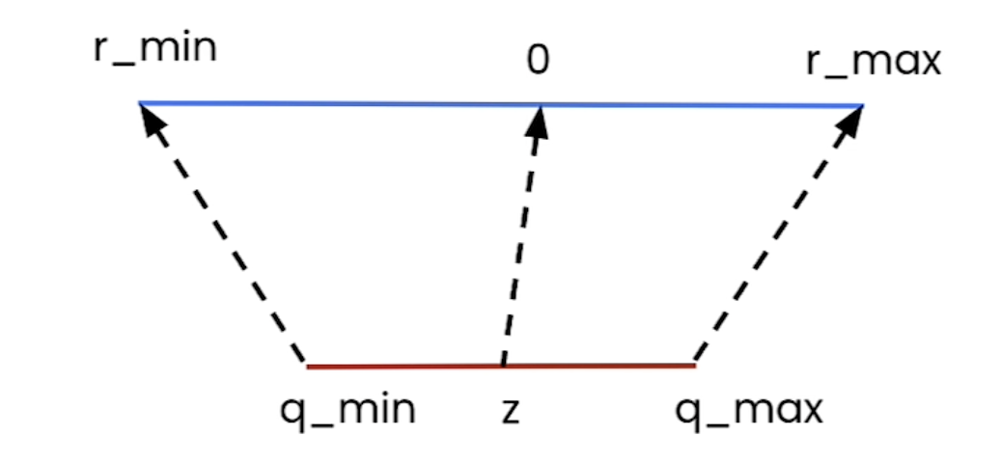
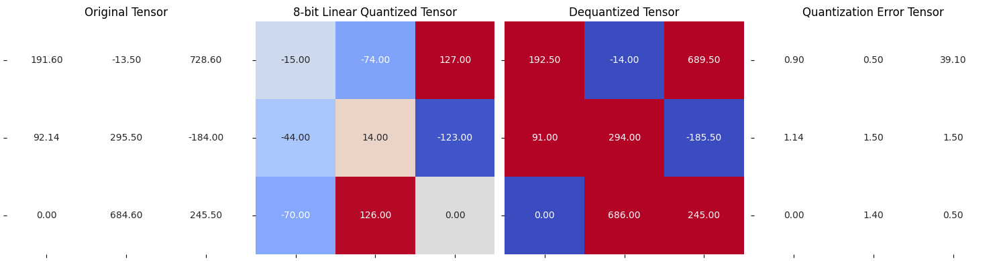
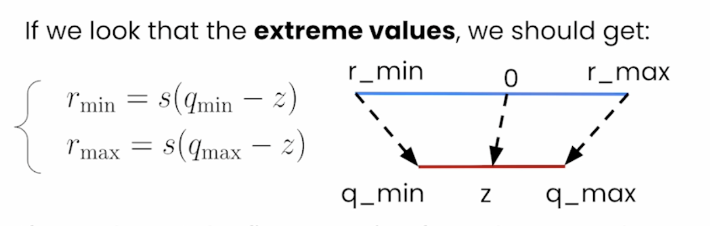
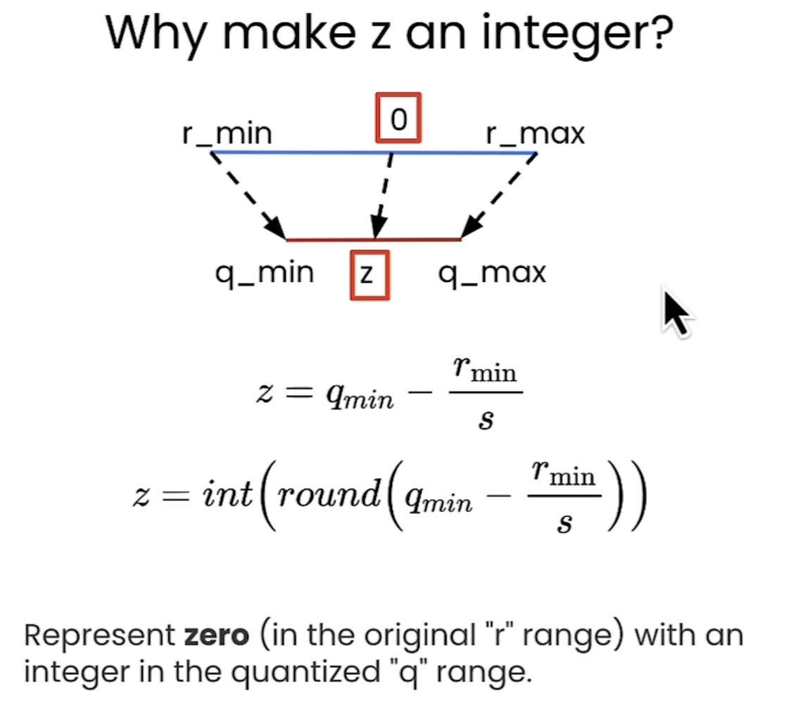
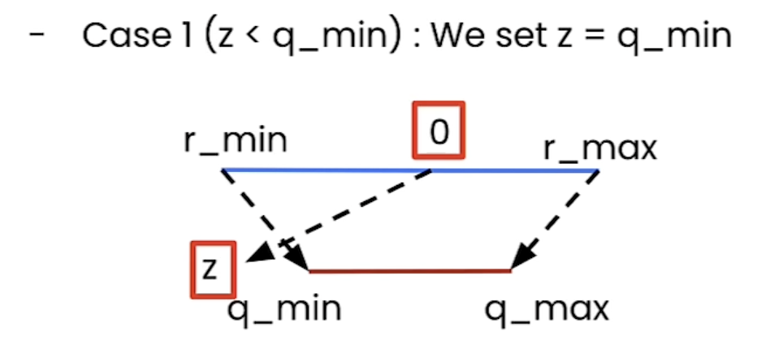
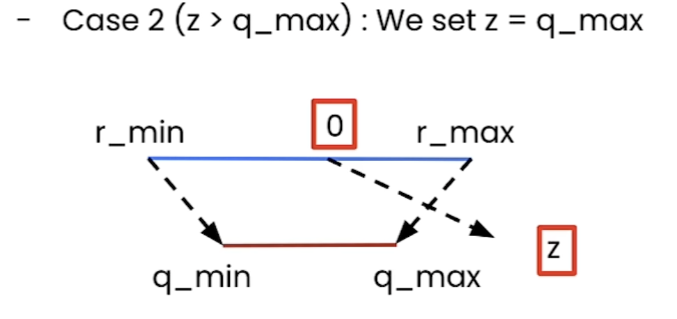

# Quantization in Depth by HuggingFace


## Lecture 1: Quantize & De-Quantize a Tensor

## Neural Network Quantization:

You can quantize:

1. The Weights: NN Parameters
2. The Activations


Quantize the NN after being trained, called Post Training Quantization (PTQ)

### Advantages of Quantization:

- Smaller Models
- Speed Gain:
    - Memory Bandwidth
    - Faster Operations:
        - GEMM: General Matrix Multiply
        - GEMV: General Matrix Vector Multiply

### Challenge of Quantization:

- Quantization Errors (the difference between quantized and de-quantized results)
- Retraining
- Limited Hardware Support
- Calibration Dataset needed
- Packing/Unpacking

### Linear Quantization



Idea: Linear Mapping

Forumla: r = s (q - z)

where:

- r → Original Value (vector before quantization)
- s → Scale (dtype of original value) `Main Parameter 1`
- q → Quantized Value (vector after quantization)
- z → Zero Point `Main Parameter 2`

We want to get `q` (the quantized vector), its formula: `q = int(round(r/s + z))`

### Quantization Error:

This is the error (difference) between the original value and the quantized value.

Following the implementation of the lecture, and by using random values for the 2 parameters of the Linear Mapping formula, we get the following difference:



In the next lesson, you will learn how to calculate the parameters `s` & `z` instead of having them randomly.

<br>


## Lecture 2: Get the Scale `s` and Zero Point `z`

To calculate the Scale `s` and the Zero Point `z` , we should calculate the following before:

- `r_min` = minimum value of the original vector
- `r_max` = maximum value of the original vector
- `q_min` = minimum value of the quantized vector type
- `q_max` = maximum value of the quantized vector type



### Scale `s` Formula:

`s` = `r_min` - `r_max` / `q_min` - `q_max`

### Zero Point `z` Formula:

`z`  = `int(round(q_min - (r_min / s)))` 



#### Handling Zero Point `z` out of Range (Quantization Range)

- Case 1: `z` < `q_min`
    - Solution → make `z` = `q_min`
        
        
        

- Case 2: `z` > `q_max`
    - Solution → Make `z` = `q_max`
        
        
        

### Quantization Error After Calculating:

In the previous lecture, after assigning the `s` & `z` parameters randomly, the mean squared error was almost `170`.

After following the official formulas for `s` & `z` , the mean squared error almost `1`.


### Code for calculating the `z` & `s` :

```python
def get_q_scale_and_zero_point(tensor, dtype=torch.int8):
    
    q_min, q_max = torch.iinfo(dtype).min, torch.iinfo(dtype).max
    r_min, r_max = tensor.min().item(), tensor.max().item()

    scale = (r_max - r_min) / (q_max - q_min)

    zero_point = q_min - (r_min / scale)

    # clip the zero_point to fall in [quantized_min, quantized_max]
    if zero_point < q_min:
        zero_point = q_min
    elif zero_point > q_max:
        zero_point = q_max
    else:
        # round and cast to int
        zero_point = int(round(zero_point))
    
    return scale, zero_point

```

<br>

## Lecture 3: Symmetric vs Asymmetric Modes

In the previous lesson, the quantization technique is Asymmetric Quantization.

### Linear Quantization Mode

- Asymmetric: We map `[r_min, r_max]` to `[q_min, q_max]`. 
*This is what implemented in the previous lecture*
- Symmetric: We map `[-r_max, r_max]` to `[-q_max, q_max]` 
Where we can set `r_max` = `max( |r_tensor| )`

### Symmetric Quantization

We don’t need to use Zero Point, where it is alway `z=0` .

Hence, the equations:

- `q` = `int(round(r/s))`
- `s` = `r_max / q_max`

### Quantization Error using the Symmetric Approach

The following results as the error quantization:


Where the average squared error is almost to `1`.

### Difference between Symmetric & Asymmetric and when to use

Trade-off:

- Utilization of Quantization Range
    - Asymmetric → The quantization range is fully utilized
    - Symmetric → If the range is biased toward on side, this will result in the quantization range
- Simplicity
    - Symmetric mode is much simpler to the Asymmetric mode.
- Memory
    - We don’t store the zero point for the Symmetric Quantization

#### When to use

In practice:

- When we quantized **into 8 bits**, we use **Symmetric Quantization**
- When we quantized **into 2, 3, or 4 bits**, we use **Asymmetric Quantization**

<br>

## Lecture 4: Finer Granularity for more Precision

### Quantization Different Granularities

The more granular the quantization is, the more accurate it will be. However, it requires more memory, since we need to store more quantization parameters. Which are the `z` & `s` parameters.

1. **Per Tensor:** Use the parameters values for the whole tensor
2. **Per Channel (along an axis):** Calculate the parameter and apply them for each axis
3. **Per Group (group n elements together):** Calculate the parameters and apply them for each group.


<br>

## Lecture 5: Per Channel Quantization

This lecture is practical implementation of Per Channel Quantization. It showed the results for both axis ( `0 → for rows` & `1 → for columns` ). It apply the Symmetric quantization but for each axes and store it’s values.

We usually do this quantization when we want to quantize in 8-bits.

### Quantization Error:

#### For `0` Axis:


Quantization Error Almost `1.8`

#### For `1` Axis:


Quantization Error Almost `1.0`

### Code:

```python
def linear_q_symmetric_per_channel(r_tensor, dim, dtype=torch.int8):
    output_dim = r_tensor.shape[dim]
    scale = torch.zeros(output_dim)

    for index in range(output_dim):
        sub_tensor = r_tensor.select(dim, index)
        scale[index] = get_q_scale_symmetric(sub_tensor, dtype=dtype)

    scale_shape = [1] * r_tensor.dim()
    scale_shape[dim] = -1
    scale = scale.view(scale_shape)
    quantized_tensor = linear_q_with_scale_and_zero_point(
        r_tensor, scale=scale, zero_point=0, dtype=dtype)
   
    return quantized_tensor, scale
```

<br>

## Lecture 6: Per Group Quantization

Per group quantization requires a lot of memory. Just like the previous lecture, this lecture is practical implementation for the Per Group Quantization Technique.

### Quantization Error:


Quantization Error is very low, nearly to `0.1`

### Code

```python
def linear_q_symmetric_per_group(tensor, group_size, dtype=torch.int8):
    
    t_shape = tensor.shape
    assert t_shape[1] % group_size == 0
    assert tensor.dim() == 2

    tensor = tensor.view(-1, group_size)
    quantized_tensor, scale = linear_q_symmetric_per_channel(tensor, dim=0, dtype=dtype)
    quantized_tensor = quantized_tensor.view(t_shape)
    
    return quantized_tensor, scale
```

<br>

## Lecture 7: Quantizing Weights & Activations for Inference

### Inference Linear Quantization

In NN, you can quantize the Weights and the Activations.


### Code

```python
def quantized_linear_W8A32_without_bias(input, q_w, s_w, z_w):
    assert input.dtype == torch.float32
    assert q_w.dtype == torch.int8

    dequantized_weight = q_w.to(torch.float32) * s_w + z_w
    output = torch.nn.functional.linear(input, dequantized_weight)

    return output
```

<br>

## Lecture 8: Custom Build an 8-Bit Quantizer

Implementing information from previous lectures and building custom wrapper for quantizing and inferencing.

Building a Quantize to quantize any model in 8-Bit precision using PyTorch.

It is **Modality Agnostic,** meaning, it can be apply to any model type, text, vision, audio, or even multi-modal models.

### Code

```python
class W8A16LinearLayer(nn.Module):
    def __init__(self, in_features, out_features, bias=True, dtype=torch.float32):
        super().__init__()
        
        
        self.register_buffer("int8_weights", torch.randint(-128, 127, (out_features, in_features), dtype=torch.int8))
        self.register_buffer("scales", torch.randn((out_features), dtype=dtype))
        
        if bias:
            self.register_buffer("bias", torch.randn((1, out_features), dtype=dtype))    
        else:
            self.bias = None

    def quantize(self, weights):
        w_fp32 = weights.clone().to(torch.float32)

        scales = w_fp32.abs().max(dim=-1).values / 127
        scales = scales.to(weights.dtype)

        int8_weights = torch.round(weights/scales.unsqueeze(1)).to(torch.int8)
        self.int8_weights = int8_weights
        self.scales = scales
    
    def forward(self, input):
        return w8_a16_forward(self.int8_weights, input, self.scales, self.bias)
```

<br>

## Lecture 9: Replace PyTorch Layers with Quantized Layers

This lecture is only practical implementation for replacing the original torch layer of any model into quantized layer. You can find the practical implementation below.

<br>

## Lecture 10: Quantize any Open Source PyTorch Model

Like the previous lecture, this lecture is about quantize Detection Model from HuggingFace Hub using the same approach from the previous lecture. The rest of the lecture is implementation for this model, compare results, and size before & after quantization.

<br>

## Lecture 11: Load you Quantized Weights From Hugging Face

This lecture is showing how to load an original model (not quantized) from HuggingFace and quantize it without the need of fitting the original model into memory and taking all the space.

This can be done using an interesting device name from PyTorch called `meta` . With this device, the model architecture is loaded but with not tensor values in it. Now, after loading this configuration, you quantize the model, then loading it (with quantized tensor values) using the `model.load_state_dict` . 

### Code

#### Load the Model using the `torch.device('meta')`

```python
from transformers import OPTForCausalLM, AutoTokenizer, AutoConfig

model_id = "./models/facebook/opt-125m"
config = AutoConfig.from_pretrained(model_id)

with torch.device("meta"):
  model = OPTForCausalLM(config)

tokenizer = AutoTokenizer.from_pretrained(model_id)
```

#### Quantize the Layers of the Model

```python
replace_linear_with_target(model, W8A16LinearLayer, ["lm_head"])
```

#### Load the Quantized Layers of the Model

```python
from huggingface_hub import hf_hub_download

state_dict_cache_path = hf_hub_download(
    "ybelkada/opt-125m-quantized-dlai",
    "quantized_state_dict.pth"
)
state_dict = torch.load(state_dict_cache_path)
model.load_state_dict(state_dict, strict=True, assign=True)
```

<br>

## Lecture 12: Weights Packing

If we want to quantize a model into 2 or 4 bits, then the process is not straight forward like 8-bits quantization. this is because PyTorch does not support `torch.int4` or `torch.int2` , the lower bits it provide are `torch.int8` and `torch.uint8`. 

### Example

Therefore, we need to pack the weights we want to quantize, through the following steps:

if we want to have the `[1, 0, 3, 2]` to have a `int2` datatype:

1. Make this tensor into `int8` datatype
2. The bits of this vector are `00000001, 00000000, 00000011, 00000010` 
3. Take only the last 2 bits for each number `01, 00, 11, 10`
4. Combine them (from right to left) to `10110001`
5. This number in int8 is `177`.
6. Finally, the 4 numbers vector of `[1, 0, 3, 2]` in `int2` would be `[177]` in `int8`

This is Packing, where it store numbers in small bit by pack them into 1 number in larger bits.

### Advantages

- It reflect the “true” memory footprint of the quantized weights

### Disadvantages

- The unpacked Tensor need to be a shape with multiple of 8 //  n-bits
- It needs to Unpack before performing an operation (such as **Inference**)

<br>

## Lecture 13: Packing 2-bits Weights

This lecture is about practical implementation for packing 2-bits weights using Python.

### Code:

```python
def pack_weights(uint8tensor, bits):
    if uint8tensor.shape[0] * bits % 8 != 0:
        raise ValueError(f"The input shape needs to be a mutiple \
        of {8 / bits} - got {uint8tensor.shape[0]}")

    num_values = uint8tensor.shape[0] * bits // 8
    num_steps = 8 // bits
    unpacked_idx = 0
    packed_tensor = torch.zeros((num_values), dtype=torch.uint8)

    # 1 0 3 2 - 01 00 11 10
    # [0000 0000] -> 0000 0001
    # 0000 0001
    # 0000 0000 - 0000 0000
    # 0000 0011 - 0011 0000 - 0011 0001

    # 1011 0001
    
    for i in range(num_values):
        for j in range(num_steps):
            packed_tensor[i] |= uint8tensor[unpacked_idx] << (bits * j)
            unpacked_idx += 1
    return packed_tensor
```

<br>

## Lecture 14: Unpacking 2-Bits Weights

This lecture is practical implementation for unpacking 2-bits weights using Python.

### Code

```python
def unpack_weights(uint8tensor, bits):
    num_values = uint8tensor.shape[0] * 8 // bits
    num_steps = 8 // bits
    unpacked_tensor = torch.zeros((num_values), dtype=torch.uint8)
    unpacked_idx = 0

    # 1 0 3 2 - 01 00 11 10

    # [00000000 00000000 00000000 00000000]
    # [10110001 00101100 00001011 00000010]
    # [00000001 00000000 00000011 00000010]

    # 10110001
    # 00000011
   
    # 00000001

    # 1: [10110001]
    # 2: [00101100]
    # 3: [00001011]

    mask = 2 ** bits - 1
    for i in range(uint8tensor.shape[0]):
        for j in range(num_steps):
            unpacked_tensor[unpacked_idx] |= uint8tensor[i] >> (bits * j)
            unpacked_idx += 1

    unpacked_tensor &= mask
    return unpacked_tensor
```

<br>

## Lecture 15: Beyond Linear Quantization

### Challenge with Quantizing LLM

#### Emergent Feature

Emergent Feature, simply a characteristics or feature that appear at scale. When quantizing a large model such as Large Language Model, the magnitude of the hidden state started to get large. Making classical quantization techniques obsolete, thus making the linear quantization techniques failing on these models.

### LLM Quantization Algorithms:

#### 1. LLM.int8:


#### 2. SmoothQuant:

It quantize the Activation (following the W8A8 → Quantize Weight to 8-bits with Activations also in 8-bits)


#### 3. AWQ:

Iterate over a dataset (calibration dataset), to get detailed idea to which channel in the input weights, could be responsible of generating outliers features called Salient Weights 


#### Other LLM Quantization Algorithms:

1. GPTQ
2. QLoRA
3. QulP#
4. HQQ
5. AQLM

### Challenge of Quantization:

1. Retraining (Quantization Aware Training)
2. Limited Hardware support
3. Calibration dataset needed
4. Packing/Unpacking

### Further Reading:

1. MIT Han Lab
    
    https://hanlab.mit.edu/
    
2. llama.cpp discussion
    
    https://github.com/ggerganov/llama.cpp/discussions
    
3. Reddit (r/LocalLlamma)
    
    https://www.reddit.com/r/LocalLLaMA/

