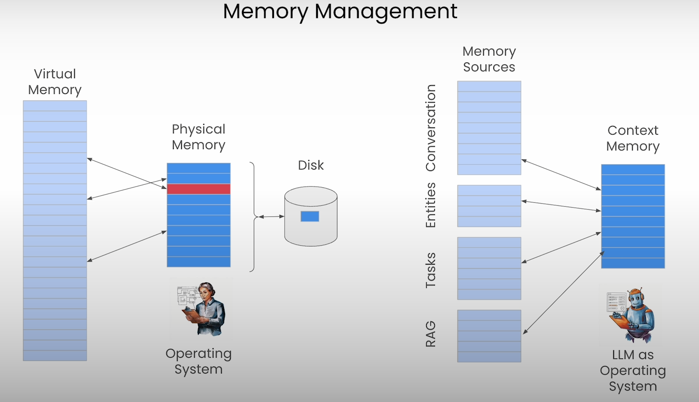

# LLM as OS: Agent Memory

 
 

  <a href="https://basel-workspace.notion.site/LLM-as-OS-Agent-Memory-16a49007fa2680d3adc8db33f9cb237c" target="_blank" style="text-decoration: none;">
    <table style="border: 2px solid #4caf50; border-radius: 10px; padding: 10px; background-color: #e8f5e9; max-width: 700px; box-shadow: 0 4px 6px rgba(0, 0, 0, 0.1); font-family: Arial, sans-serif;">
      <tr>
        <td align="center" style="padding: 15px;">
          
        </td>
        <td style="padding: 15px; text-align: left;">
          <h2 style="margin: 0; color: #2e7d32;">Explore Full Summary in Notion</h2>
          
Click here to view the detailed version with enhanced visuals and interactive content!

        </td>
      </tr>
    </table>
  </a>

 
 

# Introduction:

This course is about providing your LLM Agent a Memory to keep doing what it is specified to do. This is useful because maybe you want your Agent not to only remember the chat history, but also to remember its task, names, entities, or even external databases.

## Types of Memory:

1. Conversational Memory
2. Personalization Memory
3. Task Memory
4. Shared Memory

and many more.

Letta’s Founders created the **MemGPT** Research Paper which talks about how LLMs can have a Memory (just like the OS), Access it, Modify it, and Update it.

 
 

# Lecture 1: Implementing self-Editing Memory

### Letta VS. MemGPT:

**Letta:** Open Source Agent Framework

**MemGPT:** Research Paper introduces Self-Editing Memory for LLMs, which is an Agent Design.

### The Agentic Loop:

A Single Reasoning Step is called an **Agent Step.**

The Loop of Updating the Memory & providing answers is called the **Agentic Loop.**

#### Workflow:

The main idea of this lecture is to show you the pipeline of building self-editing memory from scratch. This is through the following:

1. Through the system prompt, giving instructions for the LLM about the Memory Section (just as a prompt)
2. Create your Memory Value (could be just a dictionary)
3. Write a function to update the Memory with new values
4. Writing a tool (prompt) for updating the memory, this tool has information about:
    1. The name of the function (Updating Memory Function)
    2. Description of the function
    3. Description of the properties of this function, parameters, types, enums, etc.
5. Providing this tool for the LLM using the `tool` parameter from OpenAI API
6. If the response of the LLM is a tool (for updating the memory), then take the updates from the LLM and execute them from the function we've created. Keep iterating (using `while True` loop) until we have a response from LLM as a message (not a tool), then show the response message to the user.

 
 

# Lecture 2: Understanding MemGPT

The Paper talks about how to build an OS for your LLM that manages the context window.

LLM OS that performs Memory Management.

### Key Ideas behind MemGPT:

1. Self-Editing Memory (showed in Lecture 1)
2. Inner Thoughts (The Agents think with itself)
3. Every Output is a Tool (the LLM always responds with a tool “messaging, edit memory, etc.”)
4. Looping via Heartbeat (when breaking down complex tasks into simpler tasks, the heartbeat tells the LLM to do further analysis, and research (or thinking more) about it).

### MemGPT Agent

All of these ideas create the MemGPT Agent, which is:

1. Autonomous
Can Take Action by itself

2. Self-Improving
Can learn over time using Long-Term Memory

### MemGPT Agent Step Example:

When the user asks a question, the agent updates the memory (with LLM call 1, Memory Update) and requests for a heartbeat to True for continuing and making another LLM call 2, Return Response for the user.

### Agent State

In MemGPT, the Agent Information is stored in a Database (other frameworks save the user's info in a variable, which can be lost if the program is closed).

In MemGPT, if the program is closed and re-opened, the data will be the same and nothing will be lost.

### Context Compilation

Whenever the Agent does an Action, it should be given a prompt, so we need to turn the agent state (which could be memory, tools, or messages) into a prompt so that the LLM can receive it and produce output.

### Breaking Down the Context Window

#### Classical Approach:

The Prompt consists of:

1. System Prompt → Instructions
2. Chat History → Set of Messages between the LLM and the User

#### MemGPT Approach:

#### 1. Core Memory

Adding a Special Section for the Context Window Called `core memory`

The Core Memory has important information about the user and the context of the chat history.

By telling the Agent that he has the ability to update the core memory using well-defined functions, inputs, and type hinting, the LLM can do it automatically.

The Core Memory could have multiple sections:

1. **User Section:** Important information about the user.
2. **Agent Section:** Important information about the user (e.g. your name is Helper, etc.)

> Core Memory Allows the MemGPT Agent to learn over time.

#### 2. Chat History Flush (Evict) → Recall Memory

**Problem:** **Running out space of in the Chat History.**

**Solution:** **Summarize all the chat history using the LLM into a single sentence**

> In MemGPT, we never delete a message

With this step, we store all the conversations in a section called Recall Memory, this section has all the messages stored on the disk, so it has unlimited storage.

So, Adding a `summary` section within the context window (the summary of all the chats), and saves all the conversation into a `recall memory`.

If the Agent needs access to old messages, it can `search` recall memory (using Tools)

#### 3. Archival Memory:

**Problem 2:** **Core Memory is also limited on size (could be 2000 character max.)**

**Solution 2:** **Create a Second Tier of Memory called “Archival Memory”.**

It has two main ways to store information in it:

1. when the `core memory` is full, then save the data within `archival memory`:
    
    
    
2. When the user uploads files, PDFs, etc, then save it in `archival memory`:
    
    
    

The Archival Memory stores the data externally (outside the context, e.g. on disk).

#### 4. A/R Stats

the final item could be within the context window, it has information/statistics about the information saved withing the Archival Memory (A) & the Recall Memory (R).

**Example 1: Extract information within the A/R Memories:**

Here, when the LLM didn’t know the answer to the question, it checked if there was any information within the Archival or Recall Memory to extract the data from. So the A/R stats weren’t empty, so it checked the data.

**Example 2: No information within the A/R Memories**

Here, the LLM didn’t know the answer to the question, then, checked the A/R stats, and saw no information in it. So, in response to the question.

### Summary

#### The Context window has these main parts (In-Context Parts):

1. System Prompt
2. Core Memory
3. A/R Stats
4. Summary (if messages exceeded the limit)
5. Chat History

#### The External data could be retrieved has these main parts (Out-of-Context Parts):

1. Archival Memory (if core memory exceeded its limit)
2. Recall Memory (if messages exceeded its limit)

All these information are translated as  `context compliation`

 
 

# Lecture 3: Building Agents with Memory

In this lesson, you will learn how to build Agents with core memory and archival memory, and how to edit these memories. This lesson is almost a full practical lesson, so you can check the code through the following notebook.

 
 

# Lecture 4: Programming Agent Memory

In this lesson, you will learn how to **create** & **inspect** Memory Blocks. Also how to **create custom** Memory Modules to use in your Agents.

### Core Memory Components:

#### 1. Memory Blocks

The main component of storing information in the core memory is the Block. the Block is a Block the has the following properties:

1. **Limit:** the max. num. of characters
2. **labels:** the label of the memory block
3. **value:** the information stored in the block

The core memory could have multiple blocks.

Also, you can share Memory Blocks between Agents. (Shared Block - Syncing Values).

#### 2. Memory Tools

Memory Tools are the tools defined within the memory, it tells the agent what type of modification it can do to the memory.

For example:

- Core Memory Replace (`core_memory_replace` function)
to replace old information with new one
- Core Memory Append (`core_memory_append` function)
to append additional information within the stored memory information

with each function you specify for the Agent what are the params of the function, types, etc.

### Customizing Memory

Memory can be customized by defining:

- Custom Blocks
- Custom Memory Tools
- Custom Memory Template (for `memory.compile()`)

 
 

# Lecture 5: Agentic RAG & External Memory

MemGPT Agents can use their external memory (Recall & Archival Memories) for Agentic RAG.

Agentic RAG allows Agents to define both when & how to retrieve data.

### MemGPT + RAG

#### 1. Default Memory

Archival Memory is the default external memory for Agentic RAG

Uploading PDF File → Goes to **Archival Memory**

#### 2. External Memories

Agents can have additional forms of external memory for retrieval source (for RAG) via tools, such as:

1. External DB → Some Sort of DB (e.g. JSON, SQL, No-SQL, etc.)
2. Google Search

The remaining lecture is the implementation of the above information using technologies such as LangChain.

 
 

# Lecture 6: Multi-Agent Orchestration

### Agent-as-a-Service

Letta Agents are designed to run as a service so that real applications can communicate with them via REST APIs

This lecture focuses on how to build & Implement Multi-Agent Collaboration via Letta’s framework.