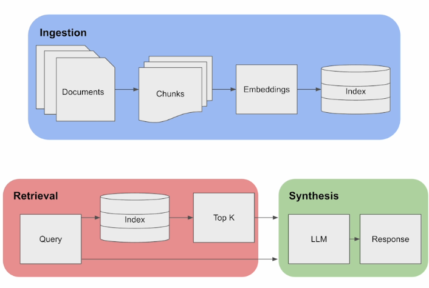
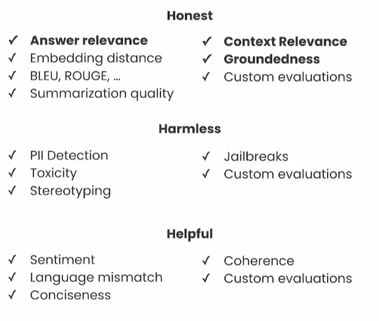

# Building & Evaluating Advanced RAG by LlamaIndex

<br>
<br>

<div align="center">
  <a href="https://basel-workspace.notion.site/Building-Evaluating-Advanced-RAG-by-LlamaIndex-17549007fa2680c48c79cca8c3c194eb" target="_blank" style="text-decoration: none;">
    <table style="border: 2px solid #4caf50; border-radius: 10px; padding: 10px; background-color: #e8f5e9; max-width: 700px; box-shadow: 0 4px 6px rgba(0, 0, 0, 0.1); font-family: Arial, sans-serif;">
      <tr>
        <td align="center" style="padding: 15px;">
          
        </td>
        <td style="padding: 15px; text-align: left;">
          <h2 style="margin: 0; color: #2e7d32;">Explore Full Summary in Notion</h2>
          <p style="margin: 0; font-size: 14px; color: #388e3c;">Click here to view the detailed version with enhanced visuals and interactive content!</p>
        </td>
      </tr>
    </table>
  </a>
</div>


<br>
<br>

## Lecture 1: Advanced RAG Pipeline

### Basic RAG Pipeline



### The RAG Triad


This will be explained in depth in the next lesson


### Advanced RAG Pipeline

#### Sentence-Window Retrieval

This technique is about taking a larger context window (before & after) of the retrieved chunks. This helps get more context about the retrieved information.


#### Auto-Merging Retrieval


<br>

## Lecture 2: RAG Triad of Metrics

### The RAG Triad:


### Answer Relevance:

Described as: `Is the final response useful?`


#### Example

Each Question & Answer is described with 4 components:

1. **Question:** The user’s Question
2. **Answer:** The Answer from the LLM/RAG Application
3. **Explanation:** An explanation as **Supporting Evidence** to describe how relevant the answer to the question
4. **Answer Relevance Score:** a numeric representation of the relevance between the Answer & Question.


#### Code

```python
from trulens_eval import OpenAI as fOpenAI
from trulens_eval import Feedback

provider = fOpenAI()
f_qa_relevance = Feedback(
    provider.relevance_with_cot_reasons,
    name="Answer Relevance"
).on_input_output()
```

### Context Relevance:

Described as: `How good is the retrieval?`


#### Example

It has 4 components:

1. **Question**: The user’s question:
2. **Retrieved Documents**
3. **Relevance Score:** for each document
4. **Mean Score:** Mean score of all the retrievals


#### Code

```python
from trulens_eval import OpenAI as fOpenAI
from trulens_eval import TruLlama
import numpy as np

provider = fOpenAI()
context_selection = TruLlama.select_source_nodes().node.text

f_qs_relevance = (
    Feedback(provider.qs_relevance, name="Context Relevance")
    .on_input()
    .on(context_selection)
    .aggregate(np.mean)
)
```


Context Relevance could have an explanation for each context relevance score.

If there are 3 retrievals, then 3 scores with 3 explanations.


### Feedback functions can be implemented in different ways:


1. **Ground Truth Evals:** Quite Expensive in Time & Human Resources
2. **Human Eval:** the user feedback for each question
3. **LLM Evals:** shows high score in scalability & Meaningful
4. **MLM Evals**
5. **Traditional NLP Evals:** the most scalable but not very meaningful

### Multiple Ways & Purposes of Evaluation:



The rest of the lecture is to demonstrate how to implement this knowledge with the ability to show the results in a dashboard as a Streamlit app using the `TrueLens` Python Package.

<br>


## Lecture 3: Sentence-Window Retrieval

The lecture is about practical implementation of the Sentence Window Retrieval Technique using `Llamaindex` for implementing the technique and `TrueLens` for Evaluating different hyperparameters for the Sentence Window Technique.

<br>


## Lecture 4: Auto-Merging Retrieval

### Explained Diagram of Auto-Merging Retrieval Technique


Just like the lecture before, this focuses on implementation of the Auto-Merging Practical Implementation using `LlamaIndex` and evaluate with with different hyperparameters through `TrueLens` .