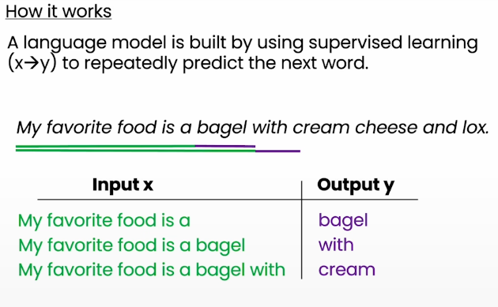

# Building Systems with ChatGPT API

<br>
<br>

<div align="center">
  <a href="https://basel-workspace.notion.site/Building-Systems-with-ChatGPT-API-17949007fa2680e5936dcb8487208ef9" target="_blank" style="text-decoration: none;">
    <table style="border: 2px solid #4caf50; border-radius: 10px; padding: 10px; background-color: #e8f5e9; max-width: 700px; box-shadow: 0 4px 6px rgba(0, 0, 0, 0.1); font-family: Arial, sans-serif;">
      <tr>
        <td align="center" style="padding: 15px;">
          
        </td>
        <td style="padding: 15px; text-align: left;">
          <h2 style="margin: 0; color: #2e7d32;">Explore Full Summary in Notion</h2>
          <p style="margin: 0; font-size: 14px; color: #388e3c;">Click here to view the detailed version with enhanced visuals and interactive content!</p>
        </td>
      </tr>
    </table>
  </a>
</div>


<br>
<br>

## **Lecture 1: Language Models, the Chat Format and Tokens**

### Large Language Model

#### Training Data:



### Types of Large Language Models (Base & Instruct)


#### From Base LLM to Instructed Tuned LLM


### System, User, and Assistant Messages


### API Key

```python
# Less Secure (not recommended)
import os
openai.api_key = "sk-abcdefghi123456789"

# More Secure
from dotenv import load_dotevn
load_dotenv()
openai.api_key = os.get_env("OPENAI_API_KEY")
```

<br>

## Lecture 2: Classification

Practical Implementation of how to use the LLM as a classifier.

<br>

## Lecture 3: Moderation

When building an LLM application, you should moderation the user messages to ensure that the user’s query meets your policy and doesn’t have any harmful, violent, etc types of messages.

OpenAI offers a free API for moderation for both text & image queries. Check the following link for more information: https://platform.openai.com/docs/guides/moderation?moderation-quickstart-examples=text

### Prompt Injection

prompt injection is a user’s prompt/query that tries to modify or ignore the delimiters of the app itself.

It is a workaround way where users try to make some corruption and do unexpected behaviors.

Note: this approach is unnecessary in more advanced models such as GPT4.

The rest of the lecture will discuss the practical implementation of this approach.

<br>

## Lecture 4: Chain of Thought Reasoning

### Chain of Though

When you want the LLM to do a complex task, then it is better to break the task into smaller steps. This is called Chain of thought, where you enable the LLM to think before responding through defined steps.

#### Example Prompt:

```python
delimiter = "####"
system_message = f"""
Follow these steps to answer the customer queries.
The customer query will be delimited with four hashtags,\
i.e. {delimiter}. 

Step 1:{delimiter} CoT
Step 2:{delimiter} Cot
Step 3:{delimiter} CoT
Step 4:{delimiter}: Cot
Step 5:{delimiter}: CoT

Use the following format:
Step 1:{delimiter} <step 1 reasoning>
Step 2:{delimiter} <step 2 reasoning>
Step 3:{delimiter} <step 3 reasoning>
Step 4:{delimiter} <step 4 reasoning>
Response to user:{delimiter} <response to customer>

Make sure to include {delimiter} to separate every step.
"""
```

<br>

## Lecture 5: Chaining Prompts

Chaining prompts is a powerful methodology that allows you to create a whole complex workflow and separate each step in the workflow using prompt chaining. Or something would not be achieved in a single prompt


### Reasons for using Prompts Chaining:

1. **More Focused**
Breaks down a complex task
2. **Context Limitation**
Max tokens for input & output prompts
3. **Reduce Cost**

<br>

## Lecture 6: Check Outputs

Checking output is a way to validate if the input user’s question and the agent/LLM output are relevant to each other and if the answer really answers the question. This can be done by making a prompt with the system, and user, answering prompts to the LLM, and classifying it with yes or no.

This lecture is a practical implementation of this methodology.

<br>

## Lecture 7: Evaluation

This lecture is about the practical implementation of different steps discussed through this course such as Moderation, Prompt Chaining, and etc.

<br>

## Lecture 8: Evaluation Part |

### Process of Building an Application


The rest of the lecture is about the practical implementation of how to build a test set (set of examples with questions/inputs and their answer/outputs) to evaluate the LLM with this set and check if the LLM got all, some, or none of the actual output from their response and build a score from this.