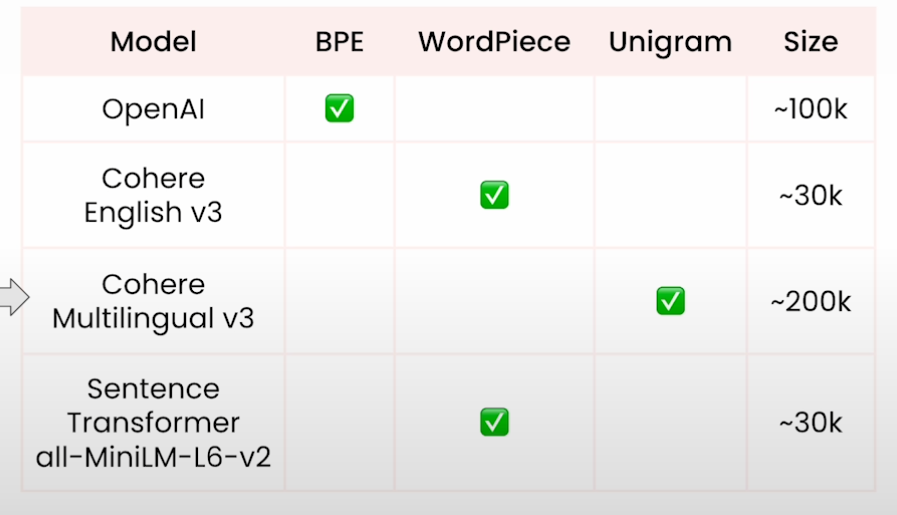

# Retrieval Optimization: Tokenization to Vector Quantization

<br>
<br>


<div align="center">
  <a href="https://basel-workspace.notion.site/Retrieval-Optimization-Tokenization-to-Vector-Quantization-16949007fa26809597f1c2b52fea2e68" target="_blank" style="text-decoration: none;">
    <table style="border: 2px solid #4caf50; border-radius: 10px; padding: 10px; background-color: #e8f5e9; max-width: 700px; box-shadow: 0 4px 6px rgba(0, 0, 0, 0.1); font-family: Arial, sans-serif;">
      <tr>
        <td align="center" style="padding: 15px;">
          
        </td>
        <td style="padding: 15px; text-align: left;">
          <h2 style="margin: 0; color: #2e7d32;">Explore Full Summary in Notion</h2>
          <p style="margin: 0; font-size: 14px; color: #388e3c;">Click here to view the detailed version with enhanced visuals and interactive content!</p>
        </td>
      </tr>
    </table>
  </a>
</div>


<br>
<br>


# Lecture 1: Embedding Models

### Tokenization Techniques

1. **Character or Byte-Based Tokenization**
2. **Word-Based Tokenization**
3. **Sub-word Tokenization** (`Walker Walked` → `Walk`, `er`, `Walk`, `ed`)

### Input of Embedding Model

1. **Pipeline:**
    - Text → Tokens (Tokenizer) → Sequence of IDs (ID per Token) → Embed Each Token (Sequence of Token Embeddings)
2. **Behavior:**
    - Each token will be **identical across runs**.

### Output of Embedding Model

1. **Pipeline:**
    - Sequence of Token Embeddings → Add Order through Positional Encoding → Process through Stacked Neural Network (NN) Modules.
2. **Behavior:**
    - Token embedding values **may vary across runs** due to NN layers.

### Token Groups in the Vocabulary

1. **Group 1:** Technical Tokens (e.g., `[CLS]`, `[SEP]`, etc.)
2. **Group 2:** Sub-word Tokens (e.g., tokens with `##` prefix)
3. **Group 3:** Prefixes and standalone words starting without `##`

<br>
<br>


# Lecture 2: Role of Tokenizers


## Tokenizer Encoding Techniques:

1. **BPE (Byte Pair Encoding)**
2. **Word Piece Encoding**
3. **Unigram Encoding**
4. **Sentence Piece Encoding** (Tokenizes multiple words together, e.g., `Real Madrid` becomes a single token.)

## Common Embedding Models Uses:



## 1. Byte Pair Encoding:

### Steps:

1. Words Split with whitespaces, then divide into characters or bytes  → Tokens of Characters
2. Now, each token (character tokens) merges to create 2 tokens (which are the most frequent pair).
3. Iterate the process until we reach the specified `vocabulary size` 

The `vocabulary_size` is a parameter specified when you are training your tokenizer model.
When training LLMs, its value could be thousands.

### Code:

```python
training_data = ["walker walked a long walk"]

from tokenizers.trainers import BpeTrainer
from tokenizers.models import BPE
from tokenizers import Tokenizer
from tokenizers.pre_tokenizers import Whitespace

bpe_tokenizer = Tokenizer(BPE())
bpe_tokenizer.pre_tokenizer = Whitespace()

bpe_trainer = BpeTrainer(vocab_size=14)

# Training process
bpe_tokenizer.train_from_iterator(training_data, bpe_trainer)
```


The `tokenizers` is a library by HuggingFace that collects many tokenizing techniques and make it ready for training tokenizing models.

### Example:

Using the `walker walked a long walk` as the training example.


## 2. WordPiece:

### Steps:

1. Differentiate the first letter from the middle one
2. Merge tokens that maximize the score:
    
    $\text{score}(u, v) = \frac{\text{frequency}(uv)}{\text{frequency}(u) \times \text{frequency}(v)}$
    
3. Iterate the process until we reach the `vocabulary size`

### Code:

```python
from tokenizers.trainers import WordPieceTrainer

unk_token = "[UNK]" # -> For Specifying Unkown Tokens/Letters

wordpiece_model = WordPiece(unk_token=unk_token)
wordpiece_tokenizer = Tokenizer(wordpiece_model)
wordpiece_tokenizer.pre_tokenizer = Whitespace()
wordpiece_trainer = WordPieceTrainer(
    vocab_size=28,
    special_tokens=[unk_token]
)
```

### Example:

using the `walker walked a long walk` as the training set


## 3. Unigram:

### Steps:

1. Unigram starts with huge vocabulary that is trimmed down.

### Code:

```python
from tokenizers.trainers import UnigramTrainer
from tokenizers.models import Unigram

unigram_tokenizer = Tokenizer(Unigram())
unigram_tokenizer.pre_tokenizer = Whitespace()
unigram_trainer = UnigramTrainer(
    vocab_size=14, 
    special_tokens=[unk_token],
    unk_token=unk_token,
)

unigram_tokenizer.train_from_iterator(training_data, unigram_trainer)
unigram_tokenizer.get_vocab()
```

### Example of one word:


It is taking high resources since there are many permutations for each word


<br>
<br>

# Lesson3: Practical Implications of the Tokenization

See the Notebook to follow the implementation:

<br>
<br>

# Lesson4: Measuring Search Relevance

To Import the Retrieval Quality, you should measure the quality before

> You can’t Improve what you don’t Measure

### Building Ground Truth:

- Measuring Search Relevance by Building the Ground Truth
- Build Dataset Pairs of Queries & Best Matching Documents
Two ways to annotate the document relevance:
    1. Binary: Either the item relevant or not
    2. Numerical: The relevance expressed as number.

## Kinds of Metrics:

1. Relevancy Based Metrics
2. Ranking Related Metrics
3. Score Related Metrics

## Relevancy Based Metrics:

### 1. Precision@k

$\text{precision@k} = \frac{\lvert \text{relevant documents in the top } k \text{ results} \rvert}{k}$

### 2. Recall@k

$\text{recall@k} = \frac{\lvert \text{relevant documents in the top } k \text{ results} \rvert}{\lvert \text{all relevant documents} \rvert}$

## Ranking Related Metrics:

### 1. Mean Reciprocal Rank (MRR).

Mean Reciprocal Rank (MRR) evaluates the effectiveness of a system by calculating the average of the reciprocal ranks of the first relevant result across all queries

$\text{MRR} = \frac{1}{|Q|} \sum_{i=1}^{|Q|} \frac{1}{\text{rank}_i}$

## Score Related Metrics:

### 1. Discount Cumulative Gain (DCG)

Discounted Cumulative Gain (DCG) assigns higher importance to documents appearing earlier in the list by incorporating a logarithmic discount factor to reflect diminishing relevance with position

$\text{DCG@k} = \sum_{i=1}^{k} \frac{\text{rel}_i}{\log_2(i + 1)}$

### 2. Normalized Discount Cumulative Gain (nDCG)

Normalized Discounted Cumulative Gain (nDCG) calculates the ratio of the DCG to the ideal DCG (IDCG), normalizing the score to evaluate the relevance of results against the perfect ranking

$\text{nDCG@k} = \frac{\text{DCG@k}}{\text{IDCG@k}}$

## Ranx

All these metrics could be calculated through `ranx` python package.

`ranx` has 2 main components for comparing:

1. **Qrels:** The Ground Truth Query with Retrievals
2. **Runs:** The Retrievals from the Vector DB.

<br>
<br>


# Lecture 5: Optimizing HNSW Search

HNSW  (Hierarchical Navigable Small Worlds) is the most common used algorithm to **approximate nearest neighbor search**

It is a Multi Layer Graph of Vectors in which connections are created between the closest points.


## Two Main Parameters in the HNSW:

### 1. the `m` parameter:

Define how many edges each node should have.
Increasing its value → Better Search Precision, BUT, Impact the Latency.

### 2. the `ef` parameter:

we find exactly `ef` closes points of the query.
The more we find, the better the better the precision of the search

We Iterate the process of finding the best  `ef` closest points to the query until we reach the last layer. Then, we apply top `k` of the nodes. 
Usually the `k` parameter is lower than the `ef` parameter.

<br>
<br>


# Lecture 6: Vector Quantization

Vector Quantization Makes Semantic Search more affordable and enhance its efficiency.
By default, the vectors of the embeddings represented in float32 value

A vector with 1536 dimension (`OpenAI Ada Embedding Model`) requires 6 KB of Memory.

| Number of Vectors | Memory Usage |
| --- | --- |
| 1 | 6 KB |
| 1M | ~6 GB |
| 1B | ~6 TB |

Quantization is here it reduce the memory usage.

<br>

## Vector Quantization Techniques:

### 1. Product Quantization (PQ)

#### Steps:
1. Original Vectors divided into chunks
2. The higher the number of chunks the lower the compression rate
3. Map each chunk into a cluster using a clustering algorithm such as `KMeans`.

It increases the Indexing Time (The Time of uploading the Vectors into the Vector DB) because we need to run clustering to find the centroids


<br>

### Rescoring

#### Problem:
When applying quantization, many vectors (with different text chunks) will have the same representation.

#### Solution:
Rescoring the retrieved vectors from the database using the following technique.

#### Technique:
Rescoring is a way to make the searching more efficient by saving the basic vectors (with the float32) in the disk, and load them to rescore the results.


### 2. Scalar Quantization (SQ)
The Simplest Technique. Basically, convert each 4-Byte floating point number into 1-Byte integer
It reduces the Indexing and Search Time, but comes with e precision cost.


<br>

### 3. Binary Quantization (BQ)
Converting floats into booleans (if the value is more than 0 → 1, else → 0)
AKA: plus number → 1 | negative number → 0

<br>

### Comparison Between the Quantization Methods
